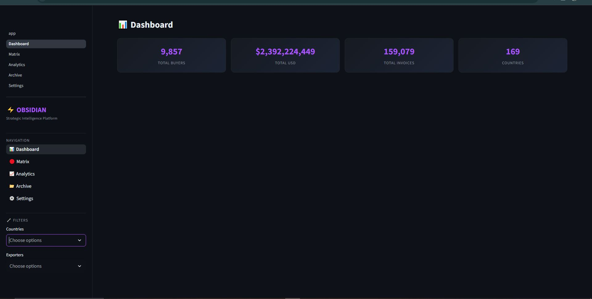

# OBSIDIAN Intelligence Platform

> Strategic buyer intelligence dashboard built with Streamlit + Supabase + Plotly.



---

## 🚀 Quick Start

### 1. Install dependencies

```bash
pip install -r requirements.txt
```

### 2. Configure Secrets

Copy the example and fill in your values:

```bash
cp .streamlit/secrets.toml.example .streamlit/secrets.toml
```

Edit `.streamlit/secrets.toml`:

```toml
SUPABASE_URL = "https://YOUR_PROJECT.supabase.co"
SUPABASE_ANON_KEY = "eyJ..."
SUPABASE_SERVICE_ROLE_KEY = "eyJ..."   # optional — for Storage uploads
APP_PASSWORD = "miky@2006"
DEEPSEEK_API_KEY = "sk-..."            # optional — enables AI Scavenge
```

> ⚠️ **NEVER commit `secrets.toml`** — it's already in `.gitignore`.

### 3. Run the app

```bash
streamlit run app.py
```

Open `http://localhost:8501`. Enter your `APP_PASSWORD` to unlock.

---

## 📄 Pages

| Page | Description |
|------|-------------|
| **Dashboard** | 3D Plotly bubble scatter (exporters × USD × invoices) + KPI cards |
| **Matrix & Intelligence** | Searchable buyer table with `@field:value` tokens, detail panel, AI Scavenge |
| **Analytics** | Bar charts, pie charts, histograms on buyer data |
| **Archive** | Upload files to Supabase Storage, manage metadata, download/recover |
| **Settings** | Login/logout, connection status, sync local JSON → Supabase |

---

## 🗄️ Supabase Schema

### Table: `buyers`

| Column | Type | Required |
|--------|------|----------|
| `id` | text (PK) | ✅ |
| `buyer_name` | text | ✅ |
| `destination_country` | text | |
| `total_usd` | numeric | |
| `total_invoices` | int | |
| `exporters` | jsonb | |
| `emails` | jsonb | |
| `websites` | jsonb | |
| `phones` | jsonb | |
| `addresses` | jsonb | |
| `company_name_english` | text | |
| `country_english` | text | |
| `country_code` | text | |

### Table: `archive_files`

| Column | Type |
|--------|------|
| `id` | uuid (PK) |
| `filename` | text |
| `storage_path` | text |
| `note` | text |
| `uploaded_at` | timestamptz |

### Storage Bucket: `archive`

Create a bucket named `archive` in Supabase Storage.  
If using service role key, uploads work automatically.  
Otherwise, set bucket policy to allow authenticated uploads.

---

## 🔍 Scavenge Search Syntax

The Matrix page supports structured search tokens:

```
@buyer:iron                       → filter buyer_name containing "iron"
@country:Kazakhstan               → filter destination_country
@destination:UAE                   → filter destination_country
@buyer:metal @country:Germany     → combine filters
free text search                   → searches across all text fields
```

---

## ☁️ Streamlit Cloud Deployment

1. Push repo to GitHub (secrets are in `.gitignore`)
2. Go to [share.streamlit.io](https://share.streamlit.io)
3. Connect your repo → set `app.py` as main file
4. Add secrets in the Streamlit Cloud dashboard (Settings → Secrets)
5. Deploy

---

## 📁 Project Structure

```
├── app.py                      # Entry point + auth gate
├── requirements.txt
├── combined_buyers.json        # Local data fallback
├── deepseek_client.py          # AI web scraper (existing)
├── .streamlit/
│   ├── config.toml             # Dark theme
│   └── secrets.toml.example    # Template
├── services/
│   ├── supabase_client.py      # Singleton Supabase client
│   └── data_helpers.py         # Data loading, search, sync
├── ui/
│   ├── style.py                # CSS injection
│   └── components.py           # Shared UI components
└── pages/
    ├── 1_Dashboard.py
    ├── 2_Matrix.py
    ├── 3_Analytics.py
    ├── 4_Archive.py
    └── 5_Settings.py
```
